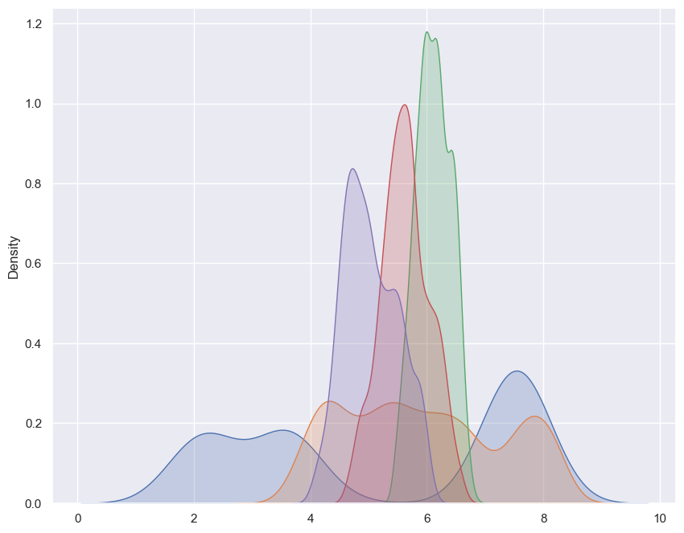
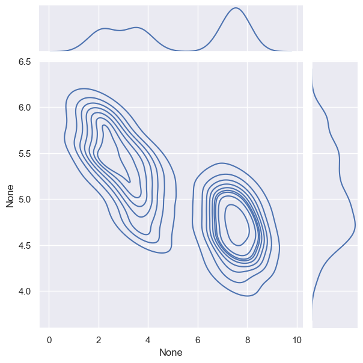
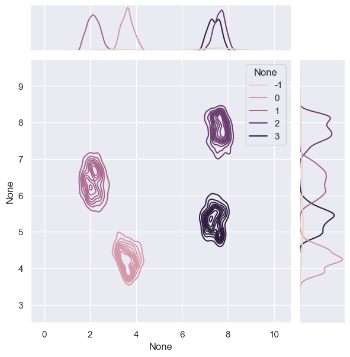
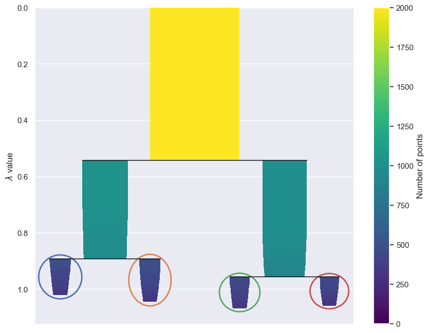
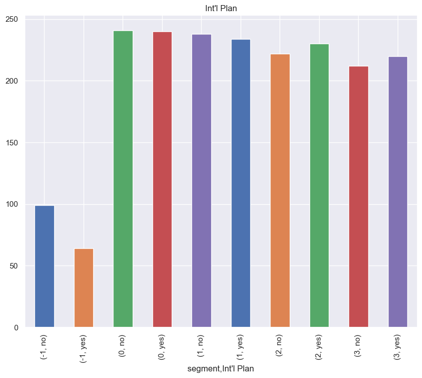
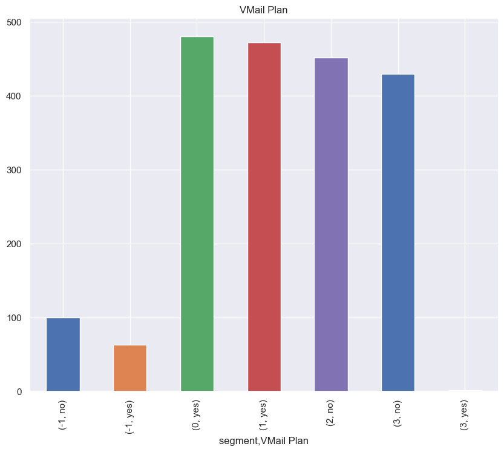
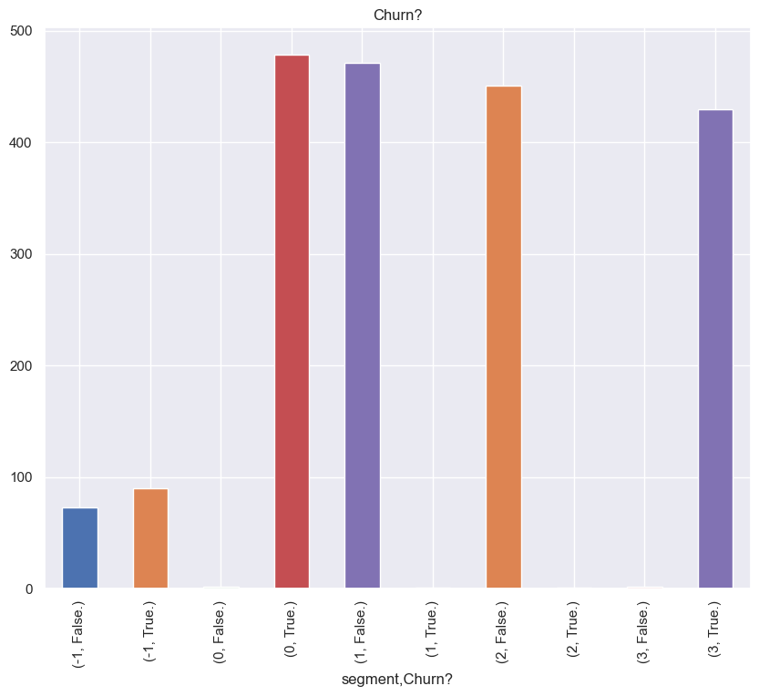

Introduction
============

Clustering is a very hard problem because there is never truly ‘right’
answer when labels are unknown.

To complicate matters further there is `No Free
Lunch <https://en.wikipedia.org/wiki/No_free_lunch_in_search_and_optimization>`__
for clustering algorithms and while one algorithm might fit a certain
dataset well, there are no guarantees that it will work on a different
data the exact same way. Likewise, clustering is *“strongly dependent on
contexts, aims and decisions of the researcher”* which adds fire to the
argument that there is no such thing as a *“universally optimal method
that will just produce natural clusters”* ( see `What Are True Clusters?
Henning 2015 <https://arxiv.org/abs/1502.02555>`__ ).

Moreover, clustering techniques that generalize well, such as KMeans,
assume that data is numerical and sphere-shaped. Having data of mixed
types with high dimensionality also presents challenges for the
downstream clustering task as classical methods such as Principal
Component Analysis PCA for dimensionality reduction do not work when
categorical values are included. This leads to a conundrum for the
practitioner where specific featurization schemes must be formalized -
such as including only numerical values or transforming all to
categorical and then using Multiple Correspondence Analysis MCA instead.

The approach outlined here seeks to solve both the difficulty in finding
a default clustering algorithm and to circumvent the difficulties
represented when data is in a mixed type form. Using a combination of
the `Uniform Manifold Approximation and Projection
UMAP <https://arxiv.org/abs/1802.03426>`__ and `Hierarchical Density
Based Clustering HDBSCAN <https://arxiv.org/abs/1705.07321>`__ we will
first take mix type data and then map it into a dense lower dimensional
space. From this dense space, we will then hierarchically group into
clusters based on the density of points. The final result will provide a
simple end to end to solution that can be applied on wide variety of
data to find meaningful clusters.

.. code:: ipython3

    %pip install matplotlib seaborn -q

.. parsed-literal::

    Note: you may need to restart the kernel to use updated packages.

.. code:: ipython3

    import warnings

    import matplotlib.pyplot as plt
    import numpy as np
    import pandas as pd
    import seaborn as sns
    import os
    import random
    from denseclus import DenseClus

    %matplotlib inline

    warnings.filterwarnings("ignore")

    sns.set_style("darkgrid", {"axes.facecolor": ".9"})
    sns.set(rc={"figure.figsize": (10, 8)})

    SEED = 42

    # set the random seed as best we can
    random.seed(SEED)
    np.random.seed(SEED)
    os.environ["PYTHONHASHSEED"] = str(SEED)

.. code:: ipython3

    data_url = (
        "https://raw.githubusercontent.com/awslabs/aws-customer-churn-pipeline/main/data/churn.txt"
    )
    df = pd.read_csv(data_url).sample(n=2000, random_state=SEED)

In this example, you will use a synthetic churn dataset for an imaginary
telecommunications company with the outcome Churn? flagged as as either
True (churned) or False (did not churn). Features include customer
details such as plan and usage information. The churn dataset is
publicly available and mentioned in the book `Discovering Knowledge in
Data by Daniel T. Larose <https://www.amazon.com/dp/0470908742/>`__. It
is attributed by the author to the University of California Irvine
Repository of Machine Learning Datasets.

.. code:: ipython3

    df.drop(["Phone", "Area Code"], axis=1, inplace=True)
    df.dtypes

.. parsed-literal::

    State              object
    Account Length      int64
    Int'l Plan         object
    VMail Plan         object
    VMail Message       int64
    Day Mins          float64
    Day Calls           int64
    Day Charge        float64
    Eve Mins          float64
    Eve Calls           int64
    Eve Charge        float64
    Night Mins        float64
    Night Calls         int64
    Night Charge      float64
    Intl Mins         float64
    Intl Calls          int64
    Intl Charge       float64
    CustServ Calls      int64
    Churn?             object
    dtype: object

As you can see the data consists of both categorical and numeric
features. Generally, speaking this is problematic for traditional
dimension reduction and clustering methods such as
`K-Means <https://en.wikipedia.org/wiki/K-means_clustering>`__ as they
rely input features to be numeric and assume that the values are shaped
spherical in nature.

With DenseClus this is not an issue because we use create UMAP
embeddings for both categorical and numerical, combining the embedding
space to output them into the densest space possible. Next HDBSCAN is
run to group densities into clusters, resulting a groups of mixed-type
data.

All of this is done under the hood and just requires a ``fit`` call like
below.

.. code:: ipython3

    hdbscan_params = {"cluster_selection_method": "leaf", "min_cluster_size": 300}

    clf = DenseClus(
        random_state=SEED,
        umap_combine_method="intersection_union_mapper",
        hdbscan_params=hdbscan_params,
    )

    clf.fit(df)

.. parsed-literal::

    Max of 51 is greater than threshold 25
    Hashing categorical features

As a recap the steps that happened are:

1). Numerical features were taken out and then reduced into a *dense*
UMAP embedding

2) Categorical features got extracted and learned into a *dense*
   separate UMAP embedding

3) The two embeddings were then combined with an intersection over union
   operation

4) HDBSCAN uses density-based spatial clustering to hierarchical-fashion
   to extract clusters from the combined space

All of these features are now attached as usable ``DenseClus`` object.

Checking Embedding Results
--------------------------

Verify the embeddings are now densely shaped.

.. code:: ipython3

    for i in range(5):
        sns.kdeplot(clf.mapper_.embedding_[:, i], shade=True)

.. code:: ipython3

    _ = sns.jointplot(x=clf.mapper_.embedding_[:, 0], y=clf.mapper_.embedding_[:, -1], kind="kde")

Inspection of Cluster Results
=============================

The clustering results are extricable from the object.

X groups formed into clusters, with the largest constituting Y% of the
data.

.. code:: ipython3

    labels = clf.score()

    print(labels, "\n")
    print(pd.DataFrame(labels).value_counts(normalize=True))

.. parsed-literal::

    [1 2 2 ... 1 2 2]

     0    0.2405
     1    0.2360
     2    0.2260
     3    0.2160
    -1    0.0815
    Name: proportion, dtype: float64

Just like with DBSCAN, labels of -1 are flagged as noise and all labels
have an associated noise probability score.

In practice, these can be thrown out or put into an ‘other’ cluster.

.. code:: ipython3

    _ = sns.jointplot(
        x=clf.mapper_.embedding_[:, 0],
        y=clf.mapper_.embedding_[:, 1],
        hue=labels,
        kind="kde",
    )

As you can see above, the clusters formed based on the densities
represented in the reduced space.

Specifically, 4 groups got identified by the data.

Since HDBSCAN is hierarchical in nature and splits based on a tree.

Instead of using the default method, you used ``leaf`` which splits into
smaller groups along the tree.

The below plot shows that the default setting would find two clusters
total but since we split along the leaf there are four.

.. code:: ipython3

    _ = clf.hdbscan_.condensed_tree_.plot(
        select_clusters=True,
        selection_palette=sns.color_palette("deep", np.unique(labels).shape[0]),
    )

Profiling the Clusters
======================

Finally, once clusters are formed, it’s common practice to then describe
what each one means.

Here, descriptive statistics is actually a very powerful (and efficient)
tool to use.

.. code:: ipython3

    df["segment"] = clf.score()

    numerics = df.select_dtypes(include=[int, float]).drop(labels=["segment"], axis=1).columns.tolist()

    df[numerics + ["segment"]].groupby(["segment"]).median()

.. raw:: html

    

    
    <table border="1" class="dataframe">
      <thead>
        <tr style="text-align: right;">
          <th></th>
          <th>Account Length</th>
          <th>VMail Message</th>
          <th>Day Mins</th>
          <th>Day Calls</th>
          <th>Day Charge</th>
          <th>Eve Mins</th>
          <th>Eve Calls</th>
          <th>Eve Charge</th>
          <th>Night Mins</th>
          <th>Night Calls</th>
          <th>Night Charge</th>
          <th>Intl Mins</th>
          <th>Intl Calls</th>
          <th>Intl Charge</th>
          <th>CustServ Calls</th>
        </tr>
        <tr>
          <th>segment</th>
          <th></th>
          <th></th>
          <th></th>
          <th></th>
          <th></th>
          <th></th>
          <th></th>
          <th></th>
          <th></th>
          <th></th>
          <th></th>
          <th></th>
          <th></th>
          <th></th>
          <th></th>
        </tr>
      </thead>
      <tbody>
        <tr>
          <th>-1</th>
          <td>110.0</td>
          <td>0.0</td>
          <td>6.123735</td>
          <td>3.0</td>
          <td>5.865395</td>
          <td>5.747944</td>
          <td>3.0</td>
          <td>5.078228</td>
          <td>4.280195</td>
          <td>200.0</td>
          <td>5.148212</td>
          <td>5.093257</td>
          <td>5.0</td>
          <td>5.208804</td>
          <td>5.0</td>
        </tr>
        <tr>
          <th>0</th>
          <td>95.0</td>
          <td>300.0</td>
          <td>7.201334</td>
          <td>4.0</td>
          <td>5.977107</td>
          <td>5.817991</td>
          <td>2.0</td>
          <td>5.891335</td>
          <td>3.983846</td>
          <td>150.0</td>
          <td>6.021921</td>
          <td>5.082877</td>
          <td>5.0</td>
          <td>4.505952</td>
          <td>6.0</td>
        </tr>
        <tr>
          <th>1</th>
          <td>106.0</td>
          <td>500.0</td>
          <td>2.712533</td>
          <td>4.0</td>
          <td>3.931738</td>
          <td>4.005048</td>
          <td>4.0</td>
          <td>3.705253</td>
          <td>4.040300</td>
          <td>300.0</td>
          <td>4.026259</td>
          <td>5.025536</td>
          <td>5.0</td>
          <td>4.053282</td>
          <td>5.0</td>
        </tr>
        <tr>
          <th>2</th>
          <td>105.0</td>
          <td>0.0</td>
          <td>3.023533</td>
          <td>3.0</td>
          <td>4.054955</td>
          <td>4.036700</td>
          <td>3.0</td>
          <td>3.944876</td>
          <td>3.920174</td>
          <td>300.0</td>
          <td>4.080238</td>
          <td>5.007394</td>
          <td>6.0</td>
          <td>3.774328</td>
          <td>6.0</td>
        </tr>
        <tr>
          <th>3</th>
          <td>100.0</td>
          <td>0.0</td>
          <td>7.628319</td>
          <td>4.0</td>
          <td>6.161486</td>
          <td>6.134396</td>
          <td>2.0</td>
          <td>6.155680</td>
          <td>3.849641</td>
          <td>150.0</td>
          <td>6.143567</td>
          <td>5.056688</td>
          <td>5.0</td>
          <td>4.660971</td>
          <td>6.0</td>
        </tr>
      </tbody>
    </table>
    

Let’s ignore group ``-1``.

You can see that only first segment ``0`` has the shortest day minutes
and high night calls. These are perhaps customers that prefer calling
(and getting called) in the night.

The second segment ``1`` has the highest day minutes and day charges.
These are customer that prefer calling (and getting called) during the
day.

This type of profiling is possible with the other segments as well,
coming up with a description of what attributes they constitute and how
they relate to your objective.

Again, this is just profiling but descriptive statistics are revealing
of what patterns are captured.

A similar type of analysis is possible with categorical features, with a
reference shown below.

.. code:: ipython3

    categorical = df.select_dtypes(include=["object"]).drop(labels=["State"], axis=1)

.. code:: ipython3

    for c in categorical.columns:
        df.groupby(["segment"] + [c]).size().plot(
            kind="bar", color=sns.color_palette("deep", np.unique(labels).shape[0])
        )
        plt.title(c)
        plt.show()

