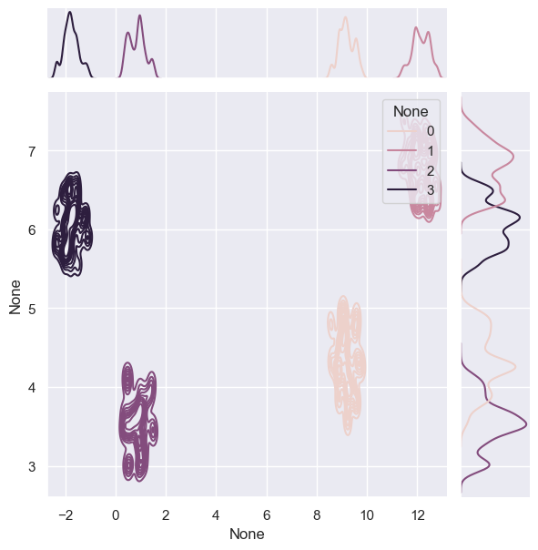
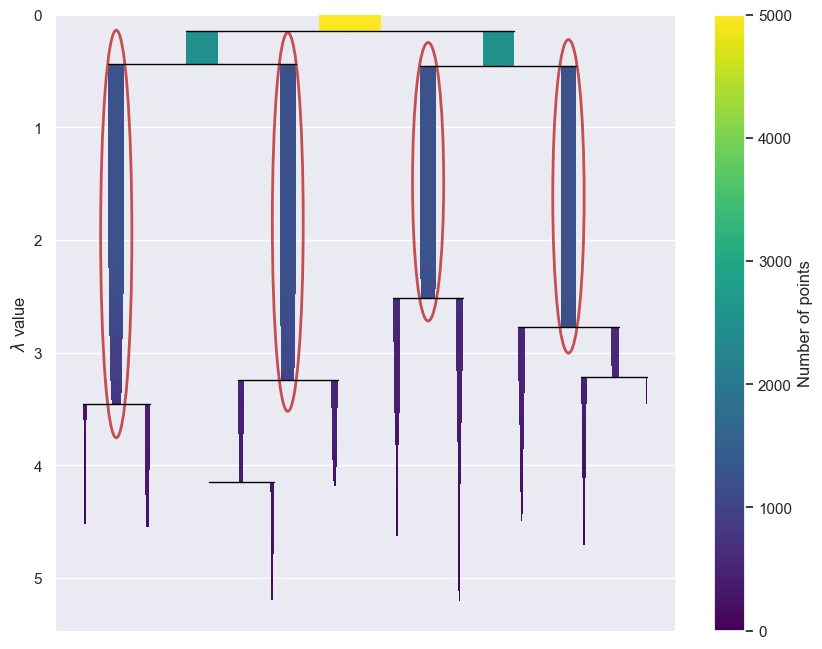

On the Validation of HDBSCAN
============================

Clustering is a very hard problem because there is never truly a ‘right’
answer when labels do not exist.

This is compounded by techniques with various assumptions in place. If a
technique is run incorrectly, violating an assumption, this leads to
incorrect (dead wrong) results.

In this blogpost, we will delve a bit into why clustering gets
complicated, and then take a dive deep on how to properly tune
density-based clusters in
`HDBSCAN <https://github.com/scikit-learn-contrib/hdbscan>`__.

\*Note: Updated 11/2023 - the order of this Notebook is changed because
DensClus convereges to the optimal metric value given the
hyperparameters. We now first tune and then call DenseClus.

Background: Clustering is Complicated
-------------------------------------

There is `No Free
Lunch <https://en.wikipedia.org/wiki/No_free_lunch_theorem>`__ for
clustering algorithms and while one algorithm might fit a certain
dataset well, there are no guarantees that it will work on a different
dataset in the exact same manner. Likewise, clustering is “strongly
dependent on contexts, aims and decisions of the researcher” which adds
fire to the argument that there is no such thing as a “universally
optimal method that will just produce natural clusters” as noted by
Henning in `What Are True Clusters? Henning
2015 <https://arxiv.org/abs/1502.02555>`__.

For example, commonly used techniques such as KMeans, assume that data
is numerical and sphere-shaped. Those types of assumptions do not fair
well when the data has high dimensionality and includes categorical
values.

Cluster data that is in violation of assumptions causes a conundrum for
the practitioner in two ways:

1) How to formalize a specific featurization scheme?
2) What clustering technique to choose?

Both of these must be formulated so that no assumptions are violated. In
practice, this can lead to a process of elimination whereby the
algorithm and featurization scheme that don’t violate an algorithm’s
assumptions is the only choice standing.

Be Wary of Your Metric
----------------------

When no labels are available it’s common to pick a objective metric such
as `Silhouette
Score <https://en.wikipedia.org/wiki/Silhouette_(clustering)>`__ to
evaluate and then decide on the final clustering result. Silhouette
Score measures cluster cohesiveness and separation with an index between
-1 to 1. It does *NOT* take into account noise in the index calculation
and makes use of distances. Distance is not applicable for a
density-based technique. Not including a noise in the objective metric
calculation violates an inherent assumption in density-based clustering.

**This means that Silhouette Score and similar indexes like it are
inappropriate for measuring density-based techniques!!!** (my own
emphasis added because I’ve seen multiple blogs on here doing it - this
is dangerous.)

Density Based Clustering Validation to the Rescue
-------------------------------------------------

Density Based Clustering Validation or DBCV works for desnity-based
clustering algorithms precisely because it takes noise into account and
captures the shape property of clusters via densities and not distances
(see the `original
paper <https://www.dbs.ifi.lmu.de/~zimek/publications/SDM2014/DBCV.pdf>`__)

As the paper explains, the final result of DBCV is a weighted sum of
“Validity Index” values of clusters. This produces a score between -1 to
1, with the larger the value the better clustering solution.

Source: Density-Based Clustering Validation, Moulavi et al. 2014

An in depth discussion is out scope here but please see the original
paper for more details.

Note that DBCV does have
`drawbacks <https://github.com/scikit-learn-contrib/hdbscan/issues/283>`__.
Like all other metrics and techniques DBCV is not immune from the
problems of complication and measurement in clustering as noted earlier.

However, outside of having groundtruth labels it provides an objective
criteria from which to judge how well-separated density-based technique
clusters are.

Example
-------

Enough of that, let’s dive into a real example.

The
`notebook <https://github.com/awslabs/amazon-denseclus/blob/main/notebooks/Tuning%20with%20HDBSCAN.ipynb>`__
is available within the `Amazon Denseclus
library <https://github.com/awslabs/amazon-denseclus>`__.

In this example, you will use a synthetic churn dataset for an imaginary
telecommunications company with the outcome Churn? flagged as as either
True (churned) or False (did not churn). Features include customer
details such as plan and usage information. The churn dataset is
publicly available and mentioned in the book `Discovering Knowledge in
Data by Daniel T. Larose <https://www.amazon.com/dp/0470908742/>`__. It
is attributed by the author to the University of California Irvine
Repository of Machine Learning Datasets.

The data includes both numeric and categorical features but will use
Denseclus to transform it into lower-dimensional, dense space to form
clusters on. For more DenseClus `see
here <https://aws.amazon.com/blogs/opensource/introducing-denseclus-an-open-source-clustering-package-for-mixed-type-data/>`__.
All of the need transformations are taken care of under the hood. You
just get to call ``fit``.

.. code:: ipython3

    %pip install matplotlib seaborn -q
    %pip install --upgrade ipywidgets -q
    %pip install --upgrade jupyter -q

.. parsed-literal::

    Note: you may need to restart the kernel to use updated packages.
    Note: you may need to restart the kernel to use updated packages.
    Note: you may need to restart the kernel to use updated packages.

.. code:: ipython3

    import logging  # to further silence deprecation warnings
    import warnings

    import hdbscan
    import joblib
    import matplotlib.pyplot as plt
    import numpy as np
    import pandas as pd
    import seaborn as sns
    from hdbscan.validity import validity_index
    from sklearn import metrics, preprocessing
    from sklearn.metrics import make_scorer
    from sklearn.model_selection import RandomizedSearchCV

    # This runs in about a minute or two
    from denseclus import DenseClus

    warnings.filterwarnings("ignore")

    %matplotlib inline

    sns.set_style("darkgrid", {"axes.facecolor": ".9"})
    sns.set(rc={"figure.figsize": (10, 8)})

    SEED = 42
    np.random.seed(SEED)  # set the random seed to reproduce results as best we can
    # see: https://umap-learn.readthedocs.io/en/latest/reproducibility.html

    data_url = (
        "https://raw.githubusercontent.com/awslabs/aws-customer-churn-pipeline/main/data/churn.txt"
    )
    df = pd.read_csv(data_url)

    df.drop(["Phone", "Area Code"], axis=1, inplace=True)

    df.head(5)

.. raw:: html

    

    
    <table border="1" class="dataframe">
      <thead>
        <tr style="text-align: right;">
          <th></th>
          <th>State</th>
          <th>Account Length</th>
          <th>Int'l Plan</th>
          <th>VMail Plan</th>
          <th>VMail Message</th>
          <th>Day Mins</th>
          <th>Day Calls</th>
          <th>Day Charge</th>
          <th>Eve Mins</th>
          <th>Eve Calls</th>
          <th>Eve Charge</th>
          <th>Night Mins</th>
          <th>Night Calls</th>
          <th>Night Charge</th>
          <th>Intl Mins</th>
          <th>Intl Calls</th>
          <th>Intl Charge</th>
          <th>CustServ Calls</th>
          <th>Churn?</th>
        </tr>
      </thead>
      <tbody>
        <tr>
          <th>0</th>
          <td>PA</td>
          <td>163</td>
          <td>no</td>
          <td>yes</td>
          <td>300</td>
          <td>8.162204</td>
          <td>3</td>
          <td>7.579174</td>
          <td>3.933035</td>
          <td>4</td>
          <td>6.508639</td>
          <td>4.065759</td>
          <td>100</td>
          <td>5.111624</td>
          <td>4.928160</td>
          <td>6</td>
          <td>5.673203</td>
          <td>3</td>
          <td>True.</td>
        </tr>
        <tr>
          <th>1</th>
          <td>SC</td>
          <td>15</td>
          <td>yes</td>
          <td>no</td>
          <td>0</td>
          <td>10.018993</td>
          <td>4</td>
          <td>4.226289</td>
          <td>2.325005</td>
          <td>0</td>
          <td>9.972592</td>
          <td>7.141040</td>
          <td>200</td>
          <td>6.436188</td>
          <td>3.221748</td>
          <td>6</td>
          <td>2.559749</td>
          <td>8</td>
          <td>False.</td>
        </tr>
        <tr>
          <th>2</th>
          <td>MO</td>
          <td>131</td>
          <td>no</td>
          <td>yes</td>
          <td>300</td>
          <td>4.708490</td>
          <td>3</td>
          <td>4.768160</td>
          <td>4.537466</td>
          <td>3</td>
          <td>4.566715</td>
          <td>5.363235</td>
          <td>100</td>
          <td>5.142451</td>
          <td>7.139023</td>
          <td>2</td>
          <td>6.254157</td>
          <td>4</td>
          <td>False.</td>
        </tr>
        <tr>
          <th>3</th>
          <td>WY</td>
          <td>75</td>
          <td>yes</td>
          <td>yes</td>
          <td>700</td>
          <td>1.268734</td>
          <td>3</td>
          <td>2.567642</td>
          <td>2.528748</td>
          <td>5</td>
          <td>2.333624</td>
          <td>3.773586</td>
          <td>450</td>
          <td>3.814413</td>
          <td>2.245779</td>
          <td>6</td>
          <td>1.080692</td>
          <td>6</td>
          <td>False.</td>
        </tr>
        <tr>
          <th>4</th>
          <td>WY</td>
          <td>146</td>
          <td>yes</td>
          <td>no</td>
          <td>0</td>
          <td>2.696177</td>
          <td>3</td>
          <td>5.908916</td>
          <td>6.015337</td>
          <td>3</td>
          <td>3.670408</td>
          <td>3.751673</td>
          <td>250</td>
          <td>2.796812</td>
          <td>6.905545</td>
          <td>4</td>
          <td>7.134343</td>
          <td>6</td>
          <td>True.</td>
        </tr>
      </tbody>
    </table>
    

Hyperparameter Tuning
---------------------

The two primary hyperparameters to look at to further improve results
are ``min_samples`` and ``min_cluster_size``, as noted in the `HDBSCAN
documentation <https://hdbscan.readthedocs.io/en/latest/parameter_selection.html>`__.

You will run multiple combinations of these to find a result that
generates high DBCV score.

In addition to looking at these hyperparameters you will also look at
cluster selection methods with Expectation of Mass eom and splitting
clusters along the tree with leaf (for details see hdbscan: Hierarchical
density based clustering In, McInnes, J. Healy, S. Astels 2017).

As HDBSCAN’s documentation notes, whereas the eom method only extracts
the most stable, condensed clusters from the tree, the leaf method
selects clusters from the bottom of the leaf nodes as well.

This results in smaller, more homogeneous clusters that are more likely
to be fine grained.

.. code:: ipython3

    # Fit a UMAP to the data to cluster on
    numerics_df = df.select_dtypes(include=[int, float])

    fitted_umap = umap.UMAP(n_components=5, n_neighbors=30, min_dist=0.0).fit(numerics_df)

.. code:: ipython3

    # we will make our own scorer for DBCV
    def dbcv_score(X, labels):
        return validity_index(X, labels)

    dbcv_scorer = make_scorer(dbcv_score, greater_is_better=True)

    logging.captureWarnings(True)

    # specify parameters and distributions to sample from
    param_distributions = {
        "min_samples": [10, 30, 50, 60, 100],
        "min_cluster_size": [100, 200, 300, 400, 500, 600],
        "cluster_selection_method": ["eom", "leaf"],
        "metric": ["euclidean", "manhattan"],
    }

    n_iter_search = 50
    random_search = RandomizedSearchCV(
        hdb,
        param_distributions=param_distributions,
        n_iter=n_iter_search,
        scoring=dbcv_scorer,
        random_state=SEED,
    )

    random_search.fit(fitted_umap.embedding_)

    print(f"Best Parameters {random_search.best_params_}")
    print(f"DBCV score :{random_search.best_estimator_.relative_validity_}")

.. parsed-literal::

    Best Parameters {'min_samples': 100, 'min_cluster_size': 300, 'metric': 'manhattan', 'cluster_selection_method': 'eom'}
    DBCV score :0.2796430582890555

Pretty good but can we do better?

DenseClus will allow us to use the categorical features and converge to
a better outcome because of it.

.. code:: ipython3

    logging.captureWarnings(True)

    clf = DenseClus(random_state=SEED, umap_combine_method="intersection")

    clf.fit(df)

.. parsed-literal::

    Max of 51 is greater than threshold 25
    Hashing categorical features

Under the hood, among other steps, Denseclus uses HDBSCAN to cluster the
data.

Let’s look at the how the data got split.

.. code:: ipython3

    embedding = clf.mapper_.embedding_
    labels = clf.score()
    clustered = labels >= 0

    cnts = pd.DataFrame(labels)[0].value_counts()
    cnts = cnts.reset_index()
    cnts.columns = ["cluster", "count"]
    print(cnts.sort_values(["cluster"]))

.. parsed-literal::

       cluster  count
    1        0   1253
    3        1   1239
    2        2   1250
    0        3   1258

Upon examination there are exactly 4 almost evenly distributed clusters
with -1 representing the noise found in the data.

In addition, to simply looking at their spread, another way to evaluate
clusters it to visualize them.

.. code:: ipython3

    _ = sns.jointplot(
        x=embedding[clustered, 0], y=embedding[clustered, 1], hue=labels[clustered], kind="kde"
    )

As you can see we have 4 distinct islands formed within this slice of
the data. Clusters have formed around these densities which is exactly
the behavior we expect DenseClus to do.

You can further confirm the outcome by plotting the tree along which the
densities were split.

This is a graphical view of the counts we saw with more information. For
example, you can see that a two cluster solution is also possible as two
densities represent the base split for the clusters.

.. code:: ipython3

    _ = clf.hdbscan_.condensed_tree_.plot(
        select_clusters=True,
        selection_palette=sns.color_palette("deep", np.unique(clustered).shape[0]),
    )

Lastly, let’s confirm that the majority of data points are covered by
our clusters and the DBCV score.

.. code:: ipython3

    coverage = np.sum(clustered) / embedding.shape[0]

    print(f"Coverage {coverage}")
    print(f"DBCV score {clf.hdbscan_.relative_validity_}")

.. parsed-literal::

    Coverage 1.0
    DBCV score 0.7532237746488655

The DBCV comes between a scale of -1 to 1.

In practice we would want a score over 0.45 to make sure that clusters
are well-separated.

Conclusion
----------

I hoped you enjoyed a closer look at how to tune hyperparameters for
HDBSCAN!!!

In this post you looked at why clustering and clustering metrics can get
complicated, you then learned about DBCV as an objective metric, and you
then applied it using Amazon Denseclus and HDBSCAN.

We’ve only scrapped the surface here. To dive deeper you could look at
the following:

-  What other type of optimization frameworks can you use in place of
   Random Search?
-  What other type of hyperparameters are possible to use for tuning?
-  What other measures are possible here for further cluster validation?
-  Can any other underlying hyperparameters in Denseclus be tweaked to
   achieve a higher score?

References
----------

*“Silhouettes: a Graphical Aid to the Interpretation and Validation of
Cluster Analysis”*, Rousseeuw 1987

*“Density-Based Clustering Validation”*, Moulavi et al. 2014

*“hdbscan: Hierarchical density based clustering In”*, McInnes, J.
Healy, S. Astels 2017
