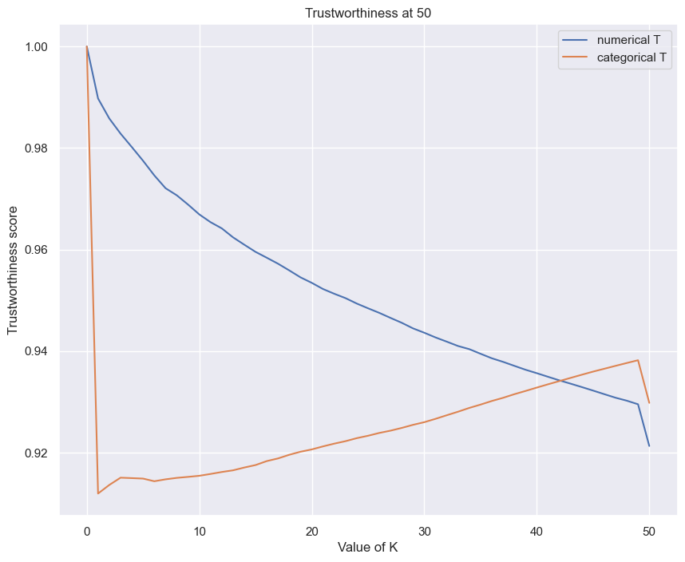

On the Validation of UMAP
=========================

There is not a large body of *practical* work on validating `Uniform
Manifold Approximation and Projection
UMAP <https://arxiv.org/abs/1802.03426>`__. In this blog post, I will
show you a real example, in hopes to provide an additional method for
validating the algorithm’s results.

In general, a common practice is to validate UMAP’s convergence based on
a downstream task. For example, in the case of classification, you use
an objective metric such as
`F1-Score <https://en.wikipedia.org/wiki/F-score>`__ to confirm that the
dimensionality reduction technique captured the underlying data
structure. However, a high F1-Score **does not assure** that UMAP
accurately captured the data’s structure. High accuracy on the
downstream task just tells you that the data is separable at
lower-dimension, performing well given it’s inputs.

Simply put, use both a measure to evaluate the underlying data’s
structure retention **and** a downstream task measure. Trustworthiness
and Continuity does the former.

This blog post will walk you through how to run Trustworthiness and
Continuity as an extra check using the DenseClus package to confirm that
UMAP converged into a stable result.

Before that, What is UMAP?
--------------------------

UMAP is a non-linear dimensionality reduction technique for high
dimensional data. Visually similar to the t-SNE algorithm (also
eclipsing it), UMAP takes in the assumption that the data is uniformly
distributed on a `locally
connected <https://en.wikipedia.org/wiki/Locally_connected>`__
`Riemannian
manifold <https://en.wikipedia.org/wiki/Riemannian_manifold>`__ and that
the `Riemannian
metric <https://en.wikipedia.org/wiki/Riemannian_metric>`__ is locally
constant or approximately locally constant (see: `UMAP: Uniform Manifold
Approximation and Projection for Dimension Reduction — umap 0.3
documentation” <https://umap-learn.readthedocs.io/en/latest/>`__)

In the `UMAP paper <https://arxiv.org/abs/1802.03426>`__ (UMAP: Uniform
Manifold Approximation and Projection McInnes et al 2018), there are
proofs that require a PHD in Topology to fully comprehend.

For now, let’s define it as a **neighbor-based** dimensionality
reduction method that can handle numeric and/or categorical data.

If you desire a deeper level of understanding, check out the UMAP
documentation link above or one of the PyData talks by the authors.

Fitting a UMAP
--------------

At any rate, let’s grab some data to work with.

You’ll grab a data from the `Churn
Pipeline <https://github.com/awslabs/aws-customer-churn-pipeline>`__
repo directly the to run the example.

The original churn dataset is publicly available and mentioned in the
book `Discovering Knowledge in Data by Daniel T.
Larose <https://www.amazon.com/dp/0470908742/>`__. It is attributed by
the author to the University of California Irvine Repository of Machine
Learning Datasets.

.. code:: ipython3

    %pip install --upgrade jupyter -q
    %pip install --upgrade ipywidgets -q

.. parsed-literal::

    Note: you may need to restart the kernel to use updated packages.
    Note: you may need to restart the kernel to use updated packages.

.. code:: ipython3

    # To suppress deprecation warnings
    import logging
    from warnings import filterwarnings

    import matplotlib.pyplot as plt
    import numpy as np
    import pandas as pd
    import seaborn as sns
    from umap import validation

    from denseclus import DenseClus

    %matplotlib inline

    sns.set_style("darkgrid", {"axes.facecolor": ".9"})
    sns.set(rc={"figure.figsize": (10, 8)})

    SEED = 42
    np.random.seed(SEED)  # set the random seed as best we can

    data_url = (
        "https://raw.githubusercontent.com/awslabs/aws-customer-churn-pipeline/main/data/churn.txt"
    )
    df = pd.read_csv(data_url).sample(n=2000, random_state=SEED)
    df.drop(["Phone", "Area Code"], axis=1, inplace=True)

Next, now that a dataset it is loaded, let’s fit Amazon
`DenseClus <https://github.com/awslabs/amazon-denseclus>`__ to it.
Underneath the hood DenseClus runs UMAP and
`HDBSCAN <https://github.com/scikit-learn-contrib/hdbscan>`__ to fit
coherent groups to mixed type data `Read more about it in this blog post
here <https://aws.amazon.com/blogs/opensource/introducing-denseclus-an-open-source-clustering-package-for-mixed-type-data/>`__.

In essence, the below code fits two UMAP layers one for the numeric data
and one for the categorical data, and then combines the two. For the
most part, the preprocessing steps are taken care under the hood.

.. code:: ipython3

    logging.captureWarnings(True)

    hdbscan_params = {"cluster_selection_method": "leaf"}

    clf = DenseClus(
        random_state=SEED,
        hdbscan_params=hdbscan_params,
        umap_combine_method="intersection_union_mapper",
    )

    clf.fit(df)

    logging.captureWarnings(False)

.. parsed-literal::

    Max of 51 is greater than threshold 25
    Hashing categorical features

Please note that, you are setting a seed here for reproducibility, this
means UMAP is going to run on a single core. In the real world, you will
not run on a single core. This means that real world results will vary
between runs due to the algorithms stochastic nature.

.. code:: ipython3

    clf.numerical_umap_.embedding_

.. parsed-literal::

    array([[3.8573391, 7.4530907, 6.9856286, 6.4291935, 4.668752 ],
           [4.5546823, 6.836398 , 9.664777 , 5.0840516, 6.3669257],
           [5.512423 , 6.306098 , 9.828715 , 5.108828 , 6.5268445],
           ...,
           [4.495967 , 7.753233 , 7.06778  , 6.599093 , 4.713311 ],
           [4.2505097, 5.9391913, 9.287599 , 5.051394 , 6.819037 ],
           [4.91854  , 5.8084493, 9.534951 , 5.469249 , 6.5120883]],
          dtype=float32)

Trustworthiness Works
---------------------

Trustworthiness and Continuity measure how well a data’s structure is
preserved after dimensionality reduction.

Here, the distance of point *i* in high-dimensional space is measured
against its k closest neighbours using rank order, and the extent to
which each rank changes in low-dimensional space is measured. For n
samples, let r(i,j) be the rank in distance of sample i to sample j in
the high-dimensional space Uki. Similarly, let rˆ(i,j) be the rank of
the distance between sample i and sample j in low-dimensional space Vki.
Using the k-nearest neighbours, the map is considered trustworthy if
these k neighbours are also placed close to point i in the
low-dimensional space.

Similarly, continuity measures the extent to which original clusters of
datapoints are preserved, and can be considered the inverse to
trustworthiness, finding sample points that are close to point i in
low-dimensional space, but not in the high-dimensional plane.

Scores for each calculations are output between 0 and 1. The higher the
score, the more the local structure of the original dataset is retained
in the UMAP embeddings.

UMAP has a Numba optimized calculation (under the validation sub-module)
that will scale well to medium sized data. As noted
`here <https://github.com/lmcinnes/umap/issues/6>`__, another reference
is in the `SKLearn
library <https://github.com/scikit-learn/scikit-learn/blob/ccd3331f7eb3468ac96222dc5350e58c58ccba20/sklearn/manifold/t_sne.py#L394>`__.

Just like the above, the pairwise distance at point K is taken between
the original data and the embedding. If any unexpected neighbors are
found they are penalized in proportion to their rank based on the
original data

Enough of that, let’s check that the embedding captured its neighbors in
the underlying data.

Running Validation on the Data
------------------------------

For this example you will set K=50, looking at 50 neighboring points for
comparison.

*Note: you are using the default euclidean distance calculation here but
keep in mind that this is supported for alternative pari-wise or squared
distances. Ultimately, this is a problem specific choice.*

.. code:: ipython3

    K = 50

    # suppress numba deprecation warnings from UMAP
    filterwarnings("ignore")

    numerical_trustworthiness = validation.trustworthiness_vector(
        source=clf.numerical_umap_._raw_data, embedding=clf.numerical_umap_.embedding_, max_k=K
    )

    categorical_trustworthiness = validation.trustworthiness_vector(
        source=clf.categorical_umap_._raw_data, embedding=clf.categorical_umap_.embedding_, max_k=K
    )

    filterwarnings("default")

    _ = plt.plot(numerical_trustworthiness)
    _ = plt.plot(categorical_trustworthiness)
    _ = plt.ylabel("Trustworthiness score")
    _ = plt.xlabel("Value of K")
    _ = plt.title(f"Trustworthiness at {K}")
    # _=plt.ylim(0,1)
    _ = plt.legend(["numerical T", "categorical T"], loc="upper right")

Generally speaking, a score above 0.80 is considered to be a **“good”**
result. A lower score indicates that you need to look at input data and
the UMAP parameters to find a better fit.

DenseClus defaults at using K=30 for neighbors to generate the UMAP
embeddings so this is fair comparison to make.

Conclusion
----------

In this blog post you learned how to to validate UMAP embeddings by
using Trustworthiness to look at how far away neighboring points fall
between the the source data and the embeddings.

`DenseClus <https://aws.amazon.com/blogs/opensource/introducing-denseclus-an-open-source-clustering-package-for-mixed-type-data/>`__
provided an easy way to demonstrate validating multiple embeddings in
this way. Believe it or not, DenseClus combines the two into a third
embedding space to compute clusters! However, this space does not have
input data to compare as it is created via set operations between the
UMAP graphs. The best way to further validate success here is by
proceeding to running on a downstream task.

In the next blog post, I will cover just this.

If you got this far, thanks for reading :)

Keep in mind that you’ve only scratched the surface here. It’s possible
to tune the multiple underlying hyperparameters available based on the
downstream task method with Trustworthiness as a constraint.

The notebook for this examples is posted under DenseClus’s Github repo
`here <https://github.com/awslabs/amazon-denseclus/tree/main/notebooks/Validating_UMAP_Example.ipynb>`__.

References
~~~~~~~~~~

*“Uniform manifold approximation and projection for dimension
reduction”*, McInnes, Leland; Healy, John; Melville, James 2018

*“Neighborhood Preservation in Nonlinear Projection Methods: An
Experimental Study”*, Venna 2001

*“Semantically Controlled Adaptive Equalisation in Reduced
Dimensionality Parameter Space“*, Stasis et al 2016
